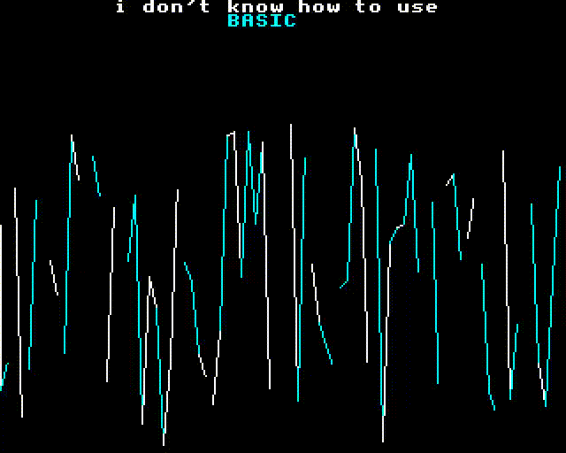

#### BBC BASIC code

```BASIC
MODE 1
COLOUR 3
MOVE 0, 512
PRINT TAB(8)"i don't know how to use"
VDU 17,2
PRINT TAB(16)"BASIC"

FOR x = 0 TO 79
GCOL 0,RND(3)+1
DRAW x*16, RND(768)
NEXT

REPEAT
VDU 19,2,RND(6)+1,0,0,0,0
VDU 19,1,RND(6)+1,0,0,0,0
z = INKEY(50)
UNTIL FALSE
```

#### GIF



