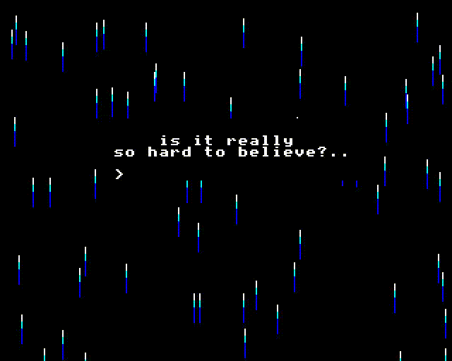

# BBC BASIC Playground

A collection of BBC BASIC experiments, mostly intended for tweeting at the [@bbcmicrobot](https://twitter.com/bbcmicrobot) and thus will be able to be shortened and base2048 encoded to 280 characters.

More documentation on the specifics of the bot and shortening code enough to fit into a tweet on the [user guide for the bot](https://github.com/8bitkick/BBCMicroBot/blob/master/docs/user%20guide.md).

### Experiments

